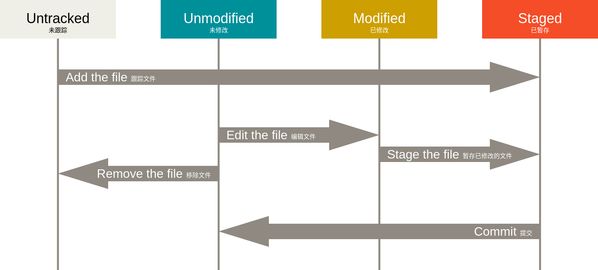

### Git 概念

Git 有三种状态，你的文件可能处于其中之一：**已提交（committed）**、**已修改（modified）**和**已暂存（staged）**。

- 已修改表示修改了文件，但还没保存到数据库中。

- 已暂存表示对一个已修改文件的当前版本做了标记，使之包含在下次提交的快照中。

- 已提交表示数据已经安全地保存在本地数据库中。

这会让我们的 Git 项目拥有三个阶段：工作区、暂存区以及 Git 目录。

工作区是对项目的某个版本独立提取出来的内容。 这些从 Git 仓库的压缩数据库中提取出来的文件，放在磁盘上供你使用或修改。

暂存区是一个文件，保存了下次将要提交的文件列表信息，一般在 Git 仓库目录中。 按照 Git 的术语叫做“索引”，不过一般说法还是叫“暂存区”。

Git 仓库目录是 Git 用来保存项目的元数据和对象数据库的地方。 这是 Git 中最重要的部分，从其它计算机克隆仓库时，复制的就是这里的数据。

基本的 Git 工作流程如下：

1. 在工作区中修改文件。
2. 将你想要下次提交的更改选择性地暂存，这样只会将更改的部分添加到暂存区。
3. 提交更新，找到暂存区的文件，将快照永久性存储到 Git 目录。

一个真实项目的 Git 仓库中，你工作目录下的每一个文件都不外呼这两种状态：**已跟踪**或**未跟踪**。已跟踪的文件是指那些被纳入了版本控制的文件，在上一次快照中有它们的记录，在工作一段时间后， 它们的状态可能是未修改，已修改或已放入暂存区。

### Git 命令

- **`git add`**：
    1. 这是一个多功能命令：可以用它开始跟踪新文件，或者把已跟踪的文件放到暂存区，还能用于合并时把有冲突的文件标记为已解决状态等。将这个命令理解为“精确地将内容添加到下一次提交中”更加合适。
    2. `git add` 命令使用文件或者目录的路径作为参数；如果参数是目录的路径，改命令将递归地跟踪该目录下的所有文件。
- **`git diff`**：
    1. 要查看尚未暂存的文件更新了哪些部分，不加参数直接输入 `git diff`；此命令比较的是工作目录中当前文件和暂存区域快照之间的差异。也就是修改之后还没暂存起来的变化内容。
    2. 若要查看已暂存的将要添加到下次提交里的内容，可以用 `git diff --staged` 命令。这条命令将对比已暂存文件与最后一次提交的文件差异。
    3. 请注意，`git diff` 本身只显示尚未暂存的改动，而不是自上次提交以来所做的所有改动。所以有时候你一下子暂存了所有更新过的文件，运行 `git diff` 后却什么也没有，就是这个原因。
- **`git rm`**：要从 Git 中移除某个文件，就必须要从已跟踪文件清单中移除（确切的说，是从暂存区域移除），然后提交。`git rm` 命令可以完成这个工作，并连带从工作目录中删除指定文件。
